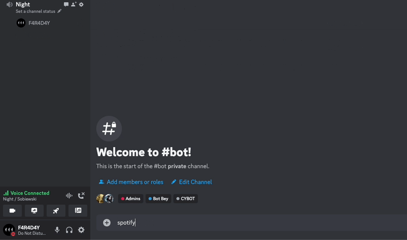

# Overview
This project provides a simple Discord bot that can play music from Spotify in a Discord voice channel. It's written in Go and uses several libraries and tools such as discordgo, opus, ffmpeg, and spotdl.

### ⚠️ Warning
> This project was crafted in just a few hours for pure entertainment. The bot executes commands on your computer via Discord. Therefore, I'm not responsible for any issues or damages that might occur. Please refrain from using this tool for malicious intent or without proper permissions. It's advised to use it in a correct and safe manner.


## Installation

### macOS (using Homebrew):
```
brew install opus opusfile ffmpeg
```

### Debian
```bash
sudo apt-get install pkg-config libopus-dev libopusfile-dev ffmpeg
```

### SpotDL
[SpotDL Installation](https://github.com/spotDL/spotify-downloader)
```bash
pip install spotdl
```
> On some systems you might have to change pip to pip3.


## Configuration
The bot uses a configuration file named config.yaml to store the bot token. This file should be placed in the project directory or any directory you specify.

Configure the bot by setting the following environment variables:
   - `CONFIG_PATH`: Path to your configuration file.
   - `CONFIG_NAME`: Name of your configuration file (without the extension, expected to be a `.yaml` file).

> Or Rename .config.yaml as config.yaml

Sample config.yaml:
```
TOKEN: "YOUR_DISCORD_BOT_TOKEN"
```


## Usage

1. Invite the bot to your server and make sure it has permissions to join voice channels and read/send messages.
2. Join a voice channel.
3. In a text channel, send the following commands:
    - `spotify [Spotify URL]`: to play a song/playlist from Spotify.
    - `pause`: to pause the current song.
    - `play`: to resume a paused song.
    - `next`: to skip to the next song in the queue.

### License
This project is licensed under the MIT License.

### Disclaimer
This bot is intended for educational and entertainment purposes only. Users should ensure they adhere to their local laws and the terms of service for Spotify or any other third-party services involved. The creator and contributors of this bot are not responsible for any misuse, damages, or legal consequences that may arise from its use. Always ensure you have the appropriate rights and permissions when playing and distributing music through this bot or any other means. Use responsibly and ethically.

### Acknowledgments

This project leverages the power of several tools and libraries. Big thanks to the developers and contributors of:

- **[ffmpeg](https://ffmpeg.org/)**: For audio processing. 
- **[spotdl](https://github.com/spotDL/spotify-downloader)**: For making Spotify song downloads a breeze.
- **[discordgo](https://github.com/bwmarrin/discordgo)**: For smooth integration with Discord's API in Go.

